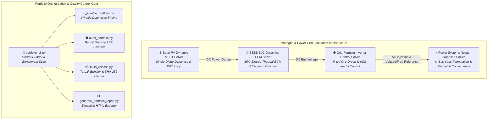

# Multi-Project Power Systems & Energy Storage Simulation Portfolio

[](https://github.com/hariszafar740-lang/ee-portfolio-master/actions/workflows/portfolio_matrix_ci.yml)

A suite of production-grade Python solvers for power systems engineering, renewable integration, battery energy storage modeling, and microgrid inverter dynamic control. Developed in Kali Linux with `pytest` unit test suites, modular architecture, and GitHub Actions CI pipelines.

---

## Portfolio Repositories & Live Build Status

| Repository | CI Status | Domain | Stack |
| :--- | :--- | :--- | :--- |
| ⚡ **[Power Systems Newton-Raphson Solver](https://github.com/hariszafar740-lang/power-systems-newton-raphson-solver)** |  | Load Flow & Grid Analysis | Python, NumPy, pytest |
| ☀️ **[Solar PV Dynamic MPPT Solver](https://github.com/hariszafar740-lang/solar-pv-mppt-dynamic-solver)** |  | Photovoltaics & Control | Python, NumPy, Matplotlib |
| 🔋 **[BESS SoC Dynamics Solver](https://github.com/hariszafar740-lang/bess-soc-dynamics-solver)** |  | Energy Storage & Thermal | Python, NumPy, Matplotlib |
| 🌐 **[Grid-Forming Inverter Control Solver](https://github.com/hariszafar740-lang/inverter-grid-control-solver)** |  | Microgrids & Power Electronics | Python, NumPy, pytest |

---

## Verification & Test Execution Across Portfolio

To execute unit tests across all repositories locally:
bash
cd ~/ee_portfolio
for dir in */; do
if [ -d "$dir/tests" ]; then
echo ""
echo "Testing $dir..."
echo ""
(cd "$dir" && source *_env/bin/activate 2>/dev/null || true && PYTHONPATH=. pytest tests/)
fi
done

## Unified CLI Orchestration

Run all engineering simulation modules directly via `portfolio_cli.py`:
bash
# Run full portfolio test benchmark
python3 portfolio_cli.py --benchmark

## Automated Performance Profiling & Diagnostics

Analyze algorithm bottleneck execution times and total function calls across all solver test suites:

```bash
python3 profile_portfolio.py

## Security Vulnerability & Static Quality Audit

Execute automated AST security vulnerability scanning and syntax checks across all solvers:
bash
python3 audit_portfolio.py

## Automated Release Bundling & Artifact Distribution

Generate production tarballs and SHA-256 verification hashes for all simulation modules:

```bash
python3 build_release.py

## Executive HTML Dashboard & Metrics Exporter

Generate interactive HTML performance and compliance reports across all solvers:

## Live Executive Dashboard

View the live interactive compliance and benchmark dashboard on GitHub Pages:
🌐 **[Live Dashboard](https://hariszafar740-lang.github.io/ee-portfolio-master/)**

## Security & Automated Quality Gates

* **Dependabot:** Weekly automated dependency vulnerability scanning enabled via `.github/dependabot.yml`.
* **Pre-commit Hooks:** Local quality gate enforced via `./setup_hooks.sh` to block commits if test suites or security audits fail.

## System Architecture & Physical Flowchart

